# ImmutableStorage

Immutable Storage for storing history, log or ledger.

To detect who recored data and changed data or not, recorded data is signed by recorder private key and stored with certificate to storage. We are also able to know where storage has data since stored data is signed by storage service.
It is important to store your private key to your private storage. You should not store decrypted private key to remote storage. However, you can not create signature before decrypting private key with secret password. Therefore, you should sign data in your LOCAL computer.

Immutable Storage is a tool to store unchangeable data such as history, log, or ledger.

Immutable Storage functions:
- Identity access management
- Remote storage management
- Library for storing immutable data to keep using private key in local computer
- Library for confidential data

## Structure
Immutable Storage consists of Immutable Storage service and client.
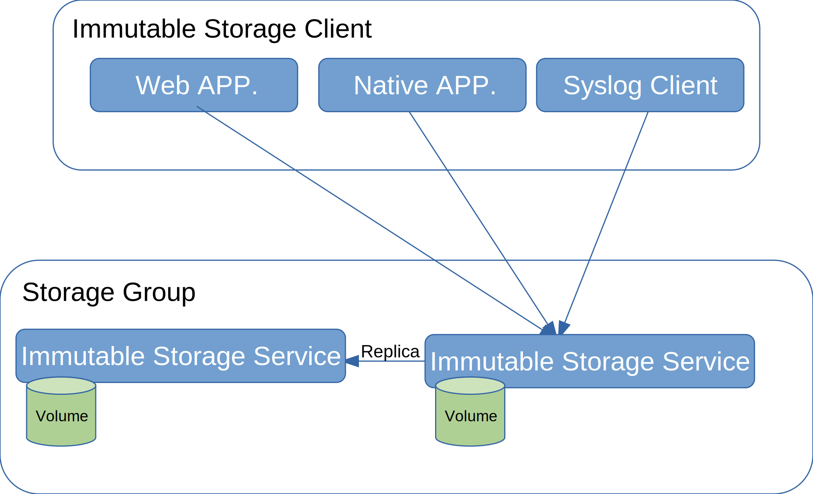

### Immutable Storage service
Immutable Storage service records data on Kubernetes environment.
Only one storage service is no problem for immutable and confidential although you can create more than one storage service to be redundant of data storage.
Storage Group consists of one or more than one Immutable Storage service.

### Immutable Storage client
There are the following three types of client for each application.

1. Web application
You can extend your web application to record immutable and confidential data using WASM module (i.e. imms.wasm)

2. Linux native application
Your Linux native application can add Immutable Storage functions from a library without writing lots of codes.

3. Syslog client
Your syslog client will get Immutable Storage functions without adding codes if you edit a configuration file for rsyslogd.

## Install Immutable Storage Service
### What you'll need
- Kubernetes such as microk8s
- containerd for image registry
- An Internet connection

### 1. Installing an Docker Image to Your Registry
The Immutable Storage Docker image can be installed to your registry with the following command as root or through sudo.

```sh
ctr i import ImmutableStorage-1.0.0.tar  --base-name imms
ctr i push REGISTRY/imms:1.0.0 imms:1.0.0
```

REGISTRY is your registry. For example, local registry is "localhost:32000" on microk8s. ctr command may be replaced by microk8s.ctr on microk8s.

### 2. Configuring Resources for Immutable Storage Service
To configure resources for Immutable Storage service, you need to edit some lines in the imms-example.yaml file.

If, for example, your registry is localhost:32000, the line defined image is the following:
 ```yaml
  - image: localhost:32000/imms:1.0.0
 ```

You must define an organization name for Immutable Storage service. This organization name will be also used as domain name in hostname.
If you want to set an organization name to example.com, a value in the imms-example.yaml file looks like:
```yaml
    - name: IMMS_ORG
      value: example.com
```

Immutable Storage service pulls docker images using the containerd socket. The service uses a configuration file imms-example.yaml for specifying the path to this socket. On microk8s, for example, containerd socket path is /var/snap/microk8s/common/run/containerd.sock and imms-example.yaml looks like this:
```yaml
 - name: containerd-sock
    hostPath:
      path: /var/snap/microk8s/common/run/containerd.sock
```

### 3. Creating Resouces for Immutable Storage Service
Resources for Immutable Storage service can be created with the following command.

```sh
kubectl create -f imms-example.yaml
```

### 4. Creating an Immutable Storage Service
#### 4.1. Enrolling a CA Administrator
You can get an initial administrator secret to enroll CA administrator with the following command.

```
kubectl logs imms
```

This command will print the secret looks like:
```
Initial administrator secret: WNB57zcz
```

You can get an IP to access Immutable Storage service.
```
kubectl svc
```

This command will print an IP for "www" service in "EXTERNAL-IP". The IP is 10.64.140.44 in this case.

```
NAME         TYPE           CLUSTER-IP       EXTERNAL-IP    PORT(S)          AGE
ca           LoadBalancer   10.152.183.132   10.64.140.43   7054:31623/TCP   3m29s
envoy        LoadBalancer   10.152.183.247   10.64.140.45   8080:31144/TCP   3m28s
kubernetes   ClusterIP      10.152.183.1     <none>         443/TCP          7d
www          LoadBalancer   10.152.183.104   10.64.140.44   443:30126/TCP    3m28s
```

You can enter a username and secret with Web-browser and then click "Enroll user" to enroll CA administrator. In this case, a username is "admin" and secret is "WNB57zcz".
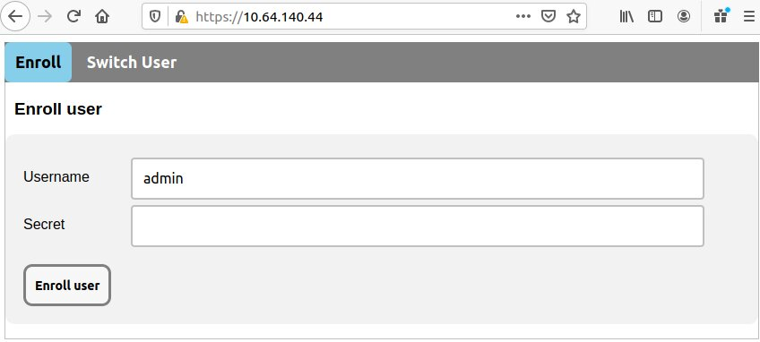

#### 4.2. Creating an Immutable Storage Service
You can enroll an administor to create an Immutable Storage service.

##### 4.2.1. Registering an Administrator for Immutable Storage service
You can add an administrator for Immutable Storage service as CA administrator.
1. Select the __Register__ tab.
2. Select the __Storage service administrator__ from the __User type__ drop-down list.
3. Type the name you want to use as administrator in the __User name__ text box.
4. Click the __Register__ button.

After clicking the __Register__, it will fill the secret in the __Secret__ text box.

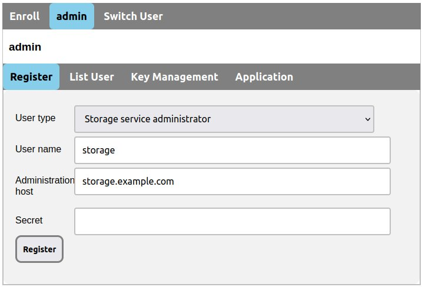

##### 4.2.2. Enrolling an Administrator for Immutable Storage Service
You can enroll an administrator for Immutable Storage service.
1. Select the __Enroll__ tab.
2. Type the name for Immutable Storage service in the __Username__ text box.
3. Type the secret, which was printed in the __Register Secret__ text box, in the __Secret__ text box.
4. Click the __Enroll__ button.

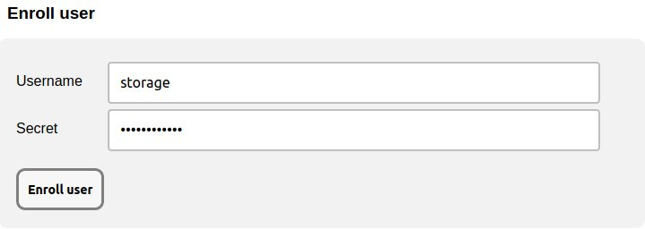

##### 4.2.3. Exporting an Immutable Storage Service
You can export an Immutable Storage service to join an Immutable Storage group.
1. Select the __Storage Service__ tab.
2. Click the __Export__ button.
3. On Mozilla Firefox, click the __Save File__ button in opening file dialog.

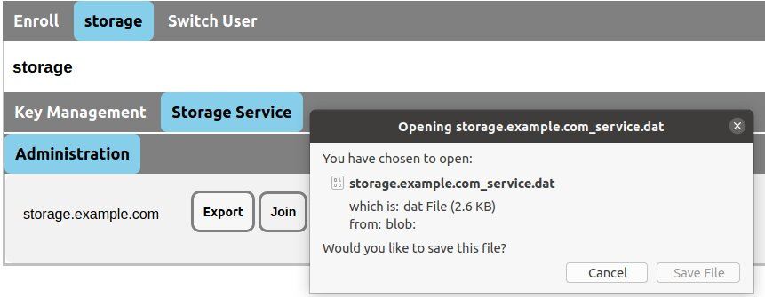

#### 4.3. Creating an Immutable Storage Group
You can create an Immutable Storage group as CA administrator.
1. Select the __Switch User__ tab.
2. Click the __admin__ radio button in the __Select a user__ list to select CA administrator.

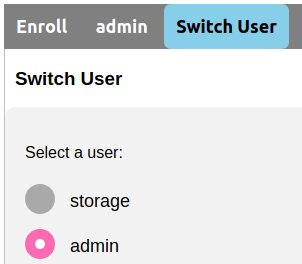

##### 4.3.1. Registering an Administrator for Immutable Storage Group
You can register an administrator for Immutable Storage group.
1. Select the __Register__ tab.
2. Select the __Storage Group administrator__ from the __User type__ drop-down list.
3. Type the name you want to use as administrator in the __User name__ text box.
4. Click the __Register__ button.

After clicking the __Register__, it will fill the secret in the __Secret__ text box.

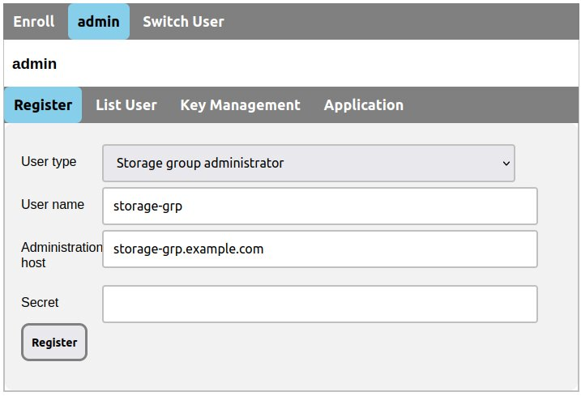

#### 4.3.2. Enrolling an Administrator for Immutable Storage Group
You can enroll an administrator for Immutable Storage group.
1. Select the __Enroll__ tab.
2. Type the name for Immutable Storage group in the __Username__ text box.
3. Type the secret, which was printed in the __Register Secret__ text box, in the __Secret__ text box.
4. Click the __Enroll__ button.

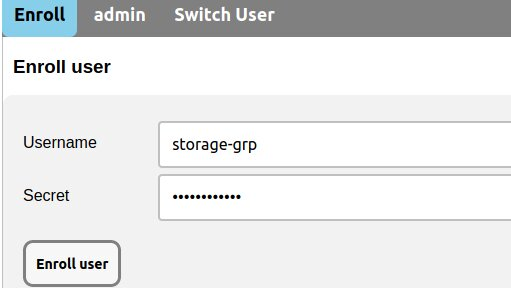

#### 4.3.3. Exporting an Immutable Storage Group
You can import some Immutable Storage services to create an Immutable Storage Group.
1. Select the __Storage Service__ tab.
2. Click the __Import__ button.
3. Select the ".dat" file that was saved in Section 4.2.3, "Exporting Immutable Storage Service".

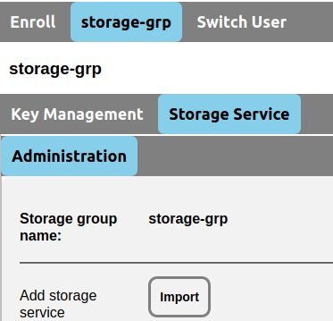

4. Click the __Export__ button.
5. Click the __Save File__ button in opening file dialog.

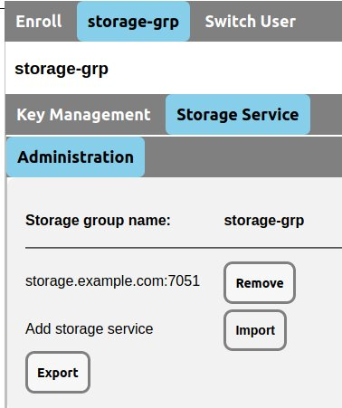

#### 4.4. Enabling an Immutable Storage Group
You can deploy an Immutable Storage group as the administrator for Immutable Storage service.

1. Select the __Swith User__ tab.
2. Click the administrator name for Immutable Storage service in the __Select a user__ list.
3. Select the administrator tab between the __Enroll__ and the __Switch User__ tab.
4. Select the __Storage Service__ tab.
5. Click the __Join__ button.
6. Select the ".block" file that was saved in Section 4.3.3, "Exporting an Immutable Storage Group".

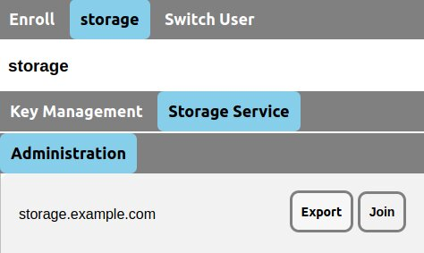

7. Click the __Enable__ button to deploy the Immutable Storage group on the Immutable Storage service.

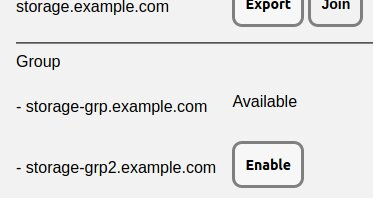

After clicking the __Enable__ button, it will appear "Available" instead of the Enable button.


## Immutable Storage Service Client

## Legal
### License
Unless otherwise noted, source files are distributed under the Apache License, Version 2.0 found in the LICENSE file.

### Trademarks
Linux and Kubernets are trademarks of The Linux Foundation registered in the United States and/or other countries.
Mozilla, Firefox and the Firefox logo are trademarks of the Mozilla Foundation in the U.S. and other countries.
All other trademars are the property of their respective owners.
