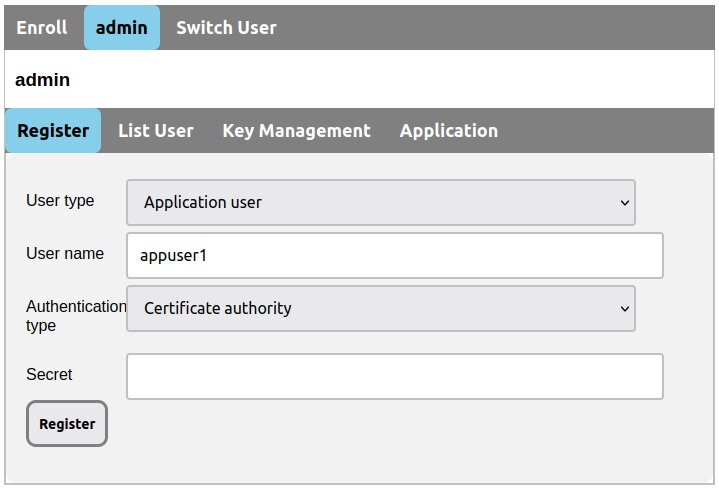
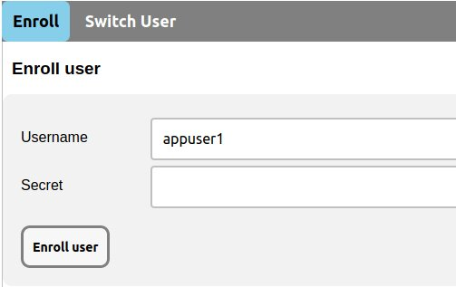
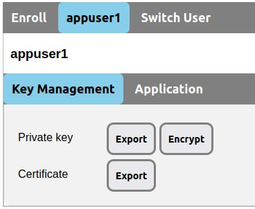

# Immutable Storage Service Client
Client applications for Immutable Storage can load and store immutable data with your signature.

## 0. Registering an Application User for Client
You can register a user for client as CA administrator.
1. Select the __Register__ tab.
2. Select the __Application user__ from the __User type__ drop-down list.
3. Type the username in the __User name__ text box.
4. Click the __Register__ button.

After clicking the __Register__, it will fill the secret in the __Secret__ text box.
You must prevent the other users from seeing this secret and send it to the registered user.



## 1. Generating a Key Pair
You can generate a key pair, which consists of a private key for the signature and a public key, as an application user to access Immutable Storage service.
You must get your secret from CA administrator before generating a key pair.
1. Select the __Enroll__ tab.
2. Type your name for Immutable Storage service in the __Username__ text box.
3. Type your secret in the __Secret__ text box.
4. Click the __Enroll__ button.

The certificate for this public key will be issued by the CA, and then a key pair, consisting of a private key and a certificate, will be stored in the current domain's local Storage on your browser.



## 2. Selecting an Application User
You can use a key pair for an application user to access Immutable Storage service.
You need to export this key pair to regular files except in Web applications since this key pair is stored on your browser.
1. Select the __Key Management__ tab.
2. Click the __Export__ button at the "Private key".
3. Click another __Export__ button at the "Certificate".



### 2.1. Web Applications
The last application user to generate the key pair is automatically selected in Web Applications.

### 2.2. Native Linux Applications
You can use the libimmds.so OpenKey() to select an application user.

```C
struct OpenKey_return {
        char* r0; /* retID */
        char* r1; /* retErr */
};
struct OpenKey_return OpenKey(char* c_userAndOrg, char* c_path, char* c_password);
```

The OpenKey() selects an application user referred to the _c_userAndOrg_ with _c_password_ in the _c_path_. If there is the immconfig.yaml file in current directory, the OpenKey() use this file to select an application user. In the immconfig.yaml, the KeyPath corresponds to the _c_userAndOrg_, and the UserName corresponds to the _c_path_.

__immconfig.yaml example__
```yaml
KeyPath: /home/appuser1/Downloads
UserName: appuser1
```

If you want to specify the key pair in the immconfig.ayml file, you should set empty string to the _c_userAndOrg_ and the _c_path_ as follows:

```C++
id = OpenKey((char*)"", (char*)"", (char*)"");
```

The OpenKey() returns an OpenKey_return struct. On success, it sets _r0_ an ID related to the key pair. If it detects an error, it sets _r1_ an error message with the reason.

__Example__
```C++
    std::string passBuf("");
    for(int i = 0; i < 5; i++){
        id = OpenKey(username, keyDir, (char *)passBuf.c_str());
        if (id.r1 == 0)
            break; // success

        if (i == 4) {
            std::cerr << "error: " << id.r1 << "\n";
            std::free(id.r1);
            return 5;
        }
        
        if (decryptErr.compare(0, decryptErr.size(), id.r1, decryptErr.size()) == 0) {
            passBuf = getPassword("Please enter the password: ");
            continue;
        }
        
        std::cerr << "error: " << id.r1 << "\n";
        std::free(id.r1);
        return 1;
    }
```

Entire example codes are [c_immds.c](../app/example/c_immds.c), [cc_immds.cc](../app/example/cc_immds.cc) and [go_immst.go](../app/example-go/go_immst.go).

The snapcraft.yaml for these examples is [here](../snap/snapcraft.yaml).

## 3. Storing Immutable Data
Immutable Storage stores data in key-value pairs. Stored data consists of signatures, certificates, a timestamp and a message.

### 3.1. Web Applications
#### 3.1.1. JavaScript
The immex.wasm __recodeImmData()__ method records immutable data.

```
recordImmData(storage-group, key, message)
```

The __recodeImmData()__ stores the _message_ with the _key_ such as program name and log name in Immutable Storage among the _storage-group_. The __recodeImmData()__ returns a Promise object. The Promise is resolved for the acceptable request. If this request is not acceptable, it is rejected with an Error object.

__Example__

```html
<button onclick="recordImmData('storage-grp', 'prog3', 'Hello')">record ledger</button>
```

Please see the [example-webjs/index.html](../app/example-webjs/index.html).

#### 3.1.2. WebAssembly
You can use the immex.wasm to store immutable data in WASM. Please refer to JavaScript section. In golang, you can also directly use the immex.go. For details, please refer to the [immex.go](../web/immex/immex.go) in golang.

### 3.2. Native Linux Applications
The libimmds.so __RecordImmData()__ stores immutable data in Immutable Storage service.

```C
char* RecordImmData(char* c_ID, char* c_storageGrp, char* c_key, char* c_msg);
```

The __RecordImmData()__ stores the _c_msg_ with _c_key_ in Immutable Storage among the _c_storageGrp_ as the application user is specified by the _c_ID_. The __RecordImmData()__ returns a string with the result. If this function succeeds in storing data, the string is zero. Otherwise it is an error string with the reason.

## 4. Loading Immutable Data
A transaction ID is related to a block consists of storing immutable data. You can get a list of transaction IDs by a key, and get a block consists of immutable data by its ID.

### 4.1. Web Applications
#### 4.1.1. JavaScript
The immex.wasm __getTxID()__ and the __getTxIDComp() methods are used to get a list of transaction IDs.

```
getTxID(storage-group, key)
getTxIDComp()
```

The immex.wasm __getTxID()__ requests to get a list of transaction IDs related to the _key_ on the _storage-group_, and then the __getTxIDComp()__ get whether the request is completed or not. The __getTxIDComp()__ returns a Promise. It is resolved with the Array object contained transaction IDs when the request is completed. It will be rejected until the request has been completed.

__Example__
```JavaScript
getTxID('storage-grp', 'prog3').then( () => {
    var timeout = Number(new Date()) + 60*1000; // 1 min
    var checkComp = (resolve, reject) => {
        getTxIDComp().then(
            txIDs => { resolve(txIDs) },
            () => {
                if( Number(new Date()) < timeout ){
                    setTimeout(checkComp, 1000, resolve, reject);
                }else {
                    reject(new Error("timeout: getTxID"));
                }
            });
    };

    return (new Promise(checkComp));
}).then( (txIDs) => {
    console.log('number of TX-IDs: ' + txIDs.length);
```

The immex.wasm __getBlockByTxID()__ and __getBlockByTxIDComp()__ are used to get a block.

```
getBlockByTxID(storage-group, txID)
getBlockByTxIDComp()
```

The __getBlockByTxID()__ requests to get a block by the _txID_ on the _storage-group_, and then the __getBlockByTxIDComp()__ gets whether this request is completed. The __getBlockByTxIDComp()__ returns a Promise object. The Promise object is resolved with a block. It will be rejected until the request has been completed.

__Example__
```JavaScript
async function asyncGetBlock() {
    for(let i = 0; i < txIDs.length; i++) {
        var timeout = Number(new Date()) + 60*1000; // 1 min
        var checkComp = (resolve, reject) => {
            getBlockByTxIDComp().then(
                block => { resolve(block) },
                () => {
                    if( Number(new Date()) < timeout ){
                        setTimeout(checkComp, 1000, resolve, reject);
                    }else{
                        reject(new Error("timeout: getBlockByTxIDComp"));
                    }
                });
        };

        console.log('log: block[' + i + ']: ' + txIDs[i])
        await getBlockByTxID('storage-grp', txIDs[i]).then(
            () => { return (new Promise(checkComp)); }
        ).then( block => {
            console.log(new TextDecoder("utf-8").decode(block))
        });
    }
}
asyncGetBlock();
```

#### 4.1.2. WebAssembly
You can also use the immex.wasm to load immutable data in WASM. Please refer to JavaScript section. In WASM using golang, you can also directly use the immex.go too. For details, please refer to the [immex.go](../web/immex/immex.go) in golang.

### 4.2. Native Linux Applications

The libimmds.so __GetTxID()__ gets a list of transaction IDs.

```C
struct GetTxID_return {
	char* r0; /* response */
	char* r1; /* retErr */
};
struct GetTxID_return GetTxID(char* c_ID, char* c_storageGrp, char* c_key);
```

The __GetTxID()__ gets a list of transaction IDs related to the _c_key_ on the _c_storageGrp_ as the application user is specified by the _c_ID_. The __GetTxID()__ returns GetTxID struct. On success, it sets _r0_ a list of transaction IDs. If it detects an error, it sets _r1_ an error message with the reason.

__Example__
```C++
struct GetTxID_return rsp = GetTxID(id.r0, storageGrp, (char*)"logCPP");
if(rsp.r1 != 0){
    std::cerr << "error: " << rsp.r1 << "\n";
    std::free(rsp.r1);
    return 3;
}
```

The __GetBlockByTxID is used to get a block.

```C
struct GetBlockByTxID_return {
	char* r0; /* response */
	long unsigned int r1; /* rspLen */
	char* r2; /* retErr */
};
struct GetBlockByTxID_return GetBlockByTxID(char* c_ID, char* c_storageGrp, char* c_txID);
```

The __GetBlockByTxID()__ gets a block by the _c_txID_ on the _c_storageGrp_ as the application user related to the _c_ID_. If this function succeeds in getting a block, the block is returned in the _r0_ and the length of block is set in the _r1_. Otherwise an error indicating the reason is returned in the _r2_. 

__Example__
```C++
    for(int i = 0; i < list.txid_size(); i++){
        std::cout << "TxID: " << list.txid(i) << "\n";
        
        blockRet = GetBlockByTxID(id.r0, storageGrp, (char*)list.txid(i).c_str());
        if(blockRet.r2 != 0){
            std::cerr << "error: " << blockRet.r2 << "\n";
            std::free(blockRet.r2);
            return 15;
        }

        common::Block blockSt;
        blockSt.ParseFromString(std::string(blockRet.r0, blockRet.r1));
        std::free(blockRet.r0);
        std::cout << "block size=" << blockRet.r1 << "\n";

        if( !blockSt.has_data() )
            continue;
```


## 5. Syslog clients

## 6. Confidential Data
### 6.1. Generating a Key Pair for Confidential Data
### 6.2. Storing Confidential Data
### 6.3. Loading Confidential Data

## Legal
### License
Unless otherwise noted, source files are distributed under the Apache License, Version 2.0 found in the LICENSE file.

### Trademarks
Linux and Kubernets are trademarks of The Linux Foundation registered in the United States and/or other countries.
Mozilla, Firefox and the Firefox logo are trademarks of the Mozilla Foundation in the U.S. and other countries.
JavaScript is a trademark of Oracle Corporation in the United States and other countries.
All other trademarks are the property of their respective owners.
